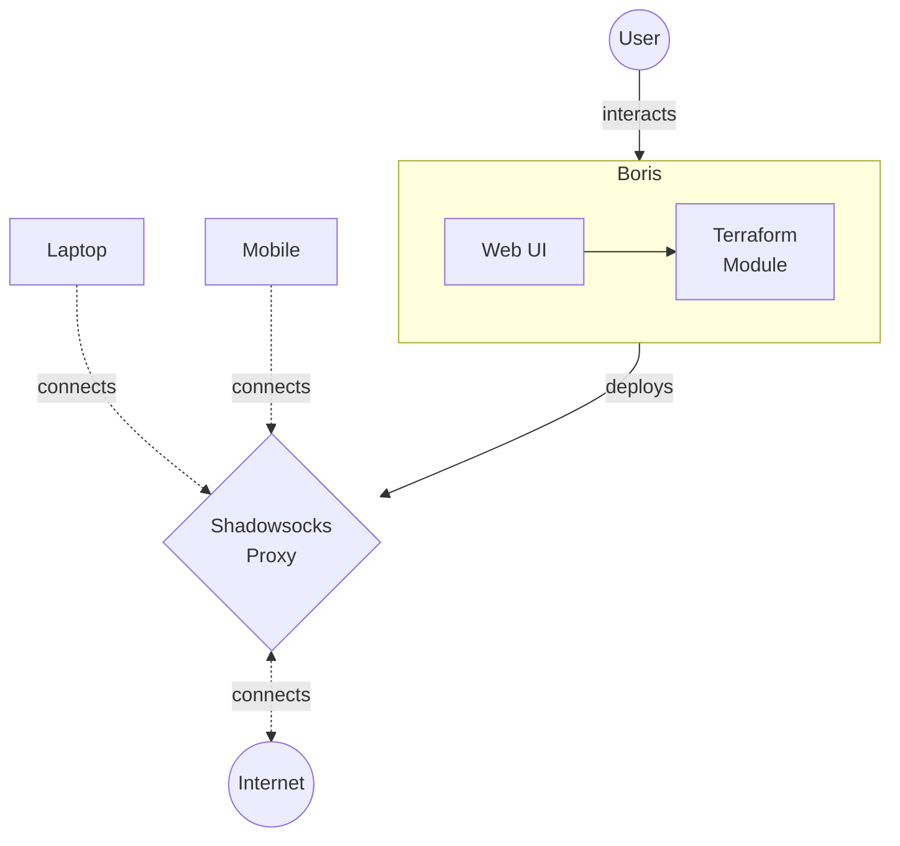

# Boris
User friendly Shadowsocks proxy deployment.

## Features
- Automated Shadowsocks proxy deployment on Alibaba Cloud
- User friendly Web UI for managing Shadowsocks deployments.
- Ability to rotate fresh IP addresses to workaround IP blocking.

## Design

System flow:
1. User interacts with Boris's Web UI to manage Shadowsocks deployments.
2. Periodically, a Terraform deployment is applied to deploy the Shadowsocks proxy on Alibaba cloud's Simple Application Server. The latter service was choosen as it bundles a generous egress data transfer together with a stable, monthly price [^3].
3. Shadowsocks server proxies requests from clients (eg. CLI & Android  App) to the internet, circumventing internet censorship.  The server uses state of the art SIP022 cipher `2022-blake3-aes-128-gcm` [^1]

### Alternatives Considered
TLS based proxies (eg. Trojan, V2Ray over Websocket) were passed up as there were reports of them being intercepted and being blocked in China [^2]

# References
[^1]:  “SIP022: Shadowsocks 2022 Edition · Issue #196 · shadowsocks/shadowsocks-org,” _GitHub_. https://github.com/shadowsocks/shadowsocks-org/issues/196 (accessed Nov. 11, 2022).
[^2]:  “Large scale blocking of TLS-based censorship circumvention tools in China · Issue #129 · net4people/bbs,” _GitHub_. https://github.com/net4people/bbs/issues/129 (accessed Nov. 11, 2022).
[^3]:  “Simple Application Server-Alibaba Cloud.” https://www.alibabacloud.com/product/swas (accessed Nov. 11, 2022).
