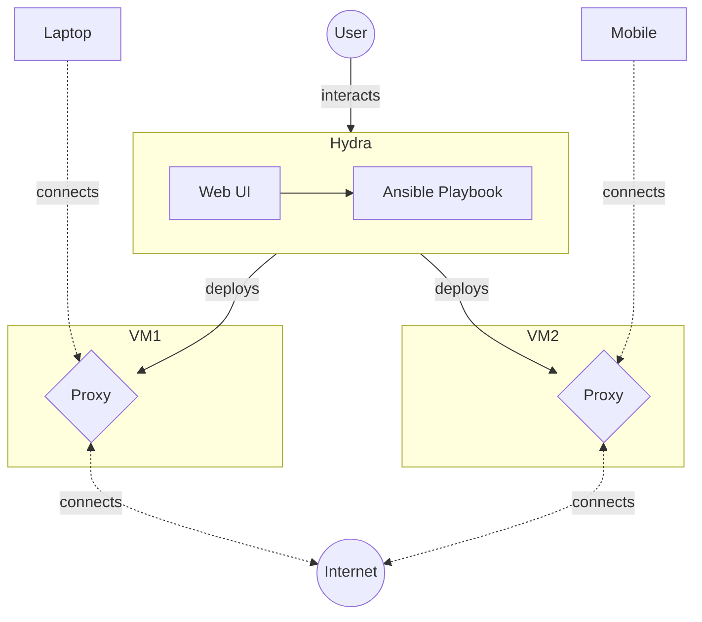

# Hydra
Deploy & manage multiple Shadowsocks proxies from one place.

## Features
- Automated proxy deployment facilitates the quick spin up  of new proxies if one is blocked.
- Centrally manage multiple proxy deployments from one place.
- User friendly Web user interface.

## Design

User flow:
1. User deploys a Linux Machine to host the proxy. For an example, see the Terraform deployment on Alibaba Cloud's Simple Application Server [^3].
2. User enrolls the Linux Machine's SSH credentials on with Boris's Web UI. Boris will deploy Shadowsocks proxies on the machine.
3. Configuration changes made by the user (eg. password, cipher changes) are automatically reflected on the deployed proxies.

> As of writing,  the recommended cipher is  `2022-blake3-aes-128-gcm` [^1]

4. Shadowsocks proxies requests from clients (eg. CLI & Android  App) to the internet, circumventing internet censorship.

### Alternatives Considered
Why shadowsocks? TLS based proxies (eg. Trojan, V2Ray over Websocket) were passed up as there were reports of them being intercepted and being blocked in China [^2]

# References
[^1]:  “SIP022: Shadowsocks 2022 Edition · Issue #196 · shadowsocks/shadowsocks-org,” _GitHub_. https://github.com/shadowsocks/shadowsocks-org/issues/196 (accessed Nov. 11, 2022).
[^2]:  “Large scale blocking of TLS-based censorship circumvention tools in China · Issue #129 · net4people/bbs,” _GitHub_. https://github.com/net4people/bbs/issues/129 (accessed Nov. 11, 2022).
[^3]:  “Simple Application Server-Alibaba Cloud.” https://www.alibabacloud.com/product/swas (accessed Nov. 11, 2022).
