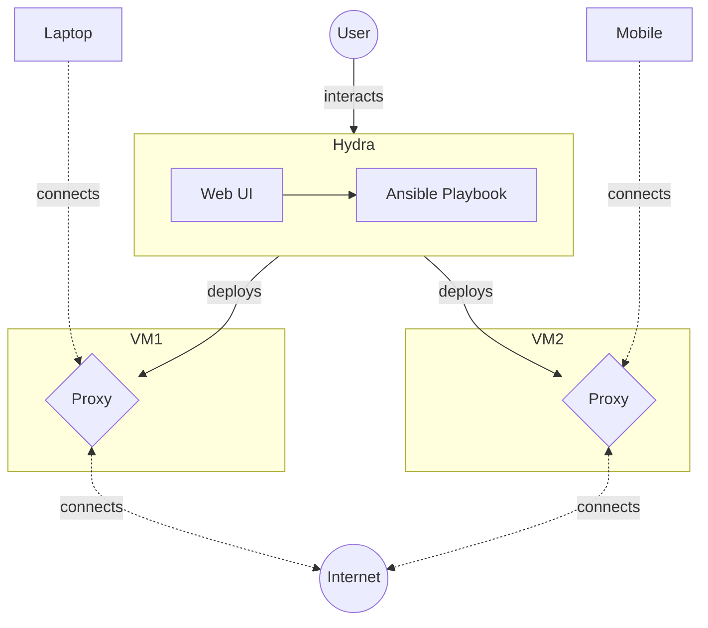

# Hydra
Deploy & manage multiple proxies from one place.

## Features
- Automated proxy deployment facilitates the quick spin up of new proxies if one is blocked.
- Centrally manage multiple proxy deployments from one place.
- User friendly Web user interface.

## Design

User flow:
1. User deploys a Linux Machine (with SSH & systemd) to host the proxy. For an example, see the Terraform deployment on Alibaba Cloud's Simple Application Server.
2. User enrolls the Linux Machine's SSH credentials on with Boris's Web UI. Boris will deploy proxies on the machine.
3. Configuration changes made by the user (eg. password, cipher changes) are automatically reflected on the deployed proxies.
4. Proxies pass requests from clients (eg. CLI & Android  App) to the internet, circumventing internet censorship.
